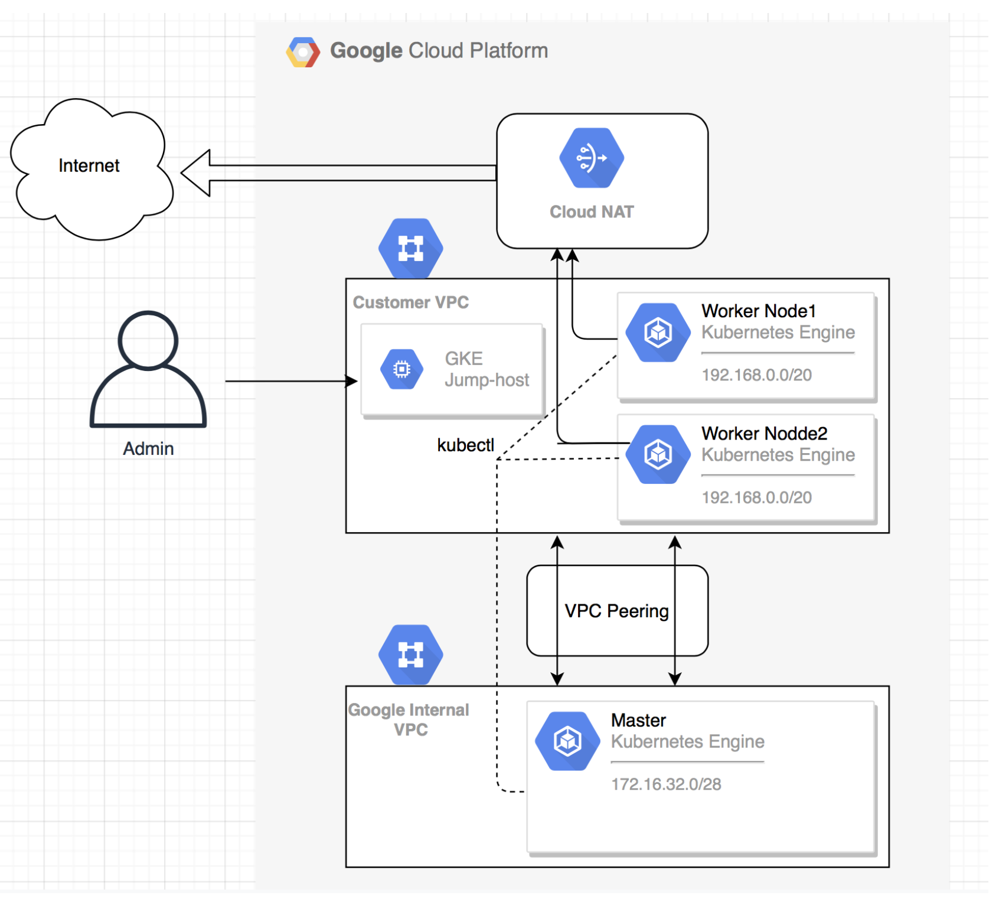

# Provision GKE via terrafrom
This repo is to Provision a GKE Private Cluster with end-to-end setup of all components.

### Implementation 

  - CLUSTER: 
      * Create GKE cluster with 2 resources google_container_cluster and google_container_node_pool. 
      * Adding private_cluster_config and related fields to make this a private cluster (enable_private_endpoint = true -> to make end-point also private)
  - NETWORK: 
      * Create custom VPC with subnet and secondary ranges (for Pods and service). 
      * Adding Cloud NAT and cloud_router for nodes to connect to internet to download images
      * Adding Firewall rule to access jump host over SSH (with tag = ssh)
  - COMPUTE: 
      * Create jump host with ready-to-ssh.

## Architecture Diagram

